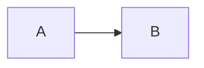

# Mermaid Previewer

[](https://github.com/zephyraft/mermaid-previewer/releases)
[](https://github.com/mermaid-js/mermaid)
[](https://chrome.google.com/webstore/detail/mermaid-previewer/oidjnlhbegipkcklbdfnbkikplpghfdl)
[](https://chrome.google.com/webstore/detail/mermaid-previewer/oidjnlhbegipkcklbdfnbkikplpghfdl)
[](https://github.com/zephyraft/mermaid-previewer/security)

一款用于预览和导出markdown中mermaid图的chrome扩展，支持bitbucket和github，完全本地渲染mermaid，不涉及远程api调用。

在符合条件的网站中，markdown中设置代码块语言为mermaid即可实现预览:


在渲染好的mermaid图上点击鼠标右键，选择"Export SVG"可导出svg文件。

## 功能列表

- [x] Bitbucket
  - [x] readme
  - [x] markdown预览
  - [x] 编辑预览
  - [x] svg导出
- [x] GitHub
  - [x] svg导出
- [x] 自定义排除列表和规则列表

同时支持以下dom结构的页面:
```html
<pre lang="mermaid">
  <code>
    graph LR
    A --> B
  </code>
</pre>
```
或者
```html
<div class="codehilite">
  <pre>
    graph LR
    A --> B
  </pre>
</div>
```


## 配置
你可以自定义配置以支持和排除更多网站，扩展的默认配置如下

排除域名:
```
chrome.google.com
gitlab.com
```
dom匹配的css选择器:
```
pre[lang='mermaid'] > code
div.codehilite > pre
```

## 改动日志
- [1.3.0]  更新mermaid版本到10.1.0，导出功能改为导出svg，以支持更多样式和font-awesome。
- [1.2.9]  更新mermaid版本到10.0.2，支持font-awesome和gitGraph。
- [1.2.8]  更新mermaid版本到9.1.3，改进toast样式。
- [1.2.7]  更新mermaid版本到8.14.0，支持GitHub mermaid导出。
- [1.2.6]  更新mermaid版本到8.13.8，优化配置页交互与样式。
- [1.2.5]  更新mermaid版本到8.13.5，修复bitbucket预览问题。
- [1.2.4]  新增popup配置页，提供域名排除列表以及dom selector配置。
- [1.2.3]  更新mermaid版本到8.13.3。
- [1.2.2]  更新mermaid版本到8.13.2。
- [1.2.1]  修复Toast。
- [1.2.0]  新增mermaid图片导出。
- [1.1.0]  新增bitbucket支持，更新mermaid版本到8.12.1。
- [1.0.1]  更新mermaid版本到8.12.0。
- [1.0.0]  首次发布，mermaid版本8.11.5。

## TODO

- [x] 自动化测试套件
- [x] 下载github原生mermaid
- [x] 改进toast样式
- [x] 支持fontawesome
- [ ] 修复自动化测试套件
- [ ] 考虑支持mmd格式文件(https://github.com/mermaid-js/mermaid-cli)
- [ ] 增加hover菜单，替换当前的上下文菜单，用于下载/复制code

## 供应商列表

- https://github.com/mermaid-js/mermaid
- https://github.com/apvarun/toastify-js
- 感谢 [JetBrains](https://www.jetbrains.com/?from=ferry) 开源license授权
  <p>
   <a href="https://www.jetbrains.com/?from=ferry">
     
   </a>
  </p>
- https://github.com/tailwindlabs/tailwindcss
- https://github.com/mozilla/webextension-polyfill
