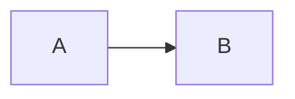

# Mermaid Previewer

## github已经于2022-02-14开始原生支持mermaid(除gist外) [链接](https://github.blog/2022-02-14-include-diagrams-markdown-files-mermaid/)

一款用于预览markdown中mermaid图的chrome插件, 本地渲染mermaid图, 不涉及远程api调用.
目前支持github和bitbucket.

markdown中设置代码块语言为mermaid:


在渲染好的mermaid图上点击鼠标右键，选择"Export png"可导出png图片.

## 支持列表

- [x] GitHub
  - [x] gist(需要名称匹配*.md)
  - [x] gist评论
  - [x] 原生mermaid下载
  - [x] ...
- [x] Bitbucket
  - [x] readme
  - [x] markdown预览
  - [x] 编辑预览
  - [x] ...
- [x] mermaid图片导出.
- [x] 提供自定义排除列表和规则列表配置能力.


同时支持以下dom结构的页面:
```html
<pre lang="mermaid">
  <code>
    graph LR
    A --> B
  </code>
</pre>
```
或者
```html
<div class="codehilite">
  <pre>
    graph LR
    A --> B
  </pre>
</div>
```


## 配置
你可以自定义配置以支持和排除更多网站，扩展的默认配置如下

排除域名:
```
chrome.google.com
gitlab.com
```
匹配Selectors:
```
pre[lang='mermaid'] > code
div.codehilite > pre
```

## 改动日志
- [1.2.8]  更新mermaid版本到9.1.3, 改进toast样式.
- [1.2.7]  更新mermaid版本到8.14.0, 支持GitHub原生mermaid下载.
- [1.2.6]  更新mermaid版本到8.13.8, 优化配置页交互与样式.
- [1.2.5]  更新mermaid版本到8.13.5. 修复bitbucket预览问题.
- [1.2.4]  新增popup配置页, 提供域名排除列表以及dom selector配置.
- [1.2.3]  更新mermaid版本到8.13.3.
- [1.2.2]  更新mermaid版本到8.13.2.
- [1.2.1]  修复Toast.
- [1.2.0]  mermaid图片导出.
- [1.1.0]  新增bitbucket支持, 更新mermaid版本到8.12.1.
- [1.0.1]  更新mermaid版本到8.12.0.
- [1.0.0]  首次发布, mermaid版本8.11.5.

## TODO

- [x] 自动化测试套件
- [x] 下载github原生mermaid
- [x] 改进toast样式
- [ ] 修复github下载toast重复问题(分离渲染，contextmenu，toast脚本，仅contextmenu脚本需要allFrames执行)
- [ ] 增加hover菜单，用于下载/复制code
- [ ] ...

## 供应商列表

- https://github.com/mermaid-js/mermaid
- https://github.com/apvarun/toastify-js
- 感谢 [JetBrains](https://www.jetbrains.com/?from=ferry) 开源license授权
  <p>
   <a href="https://www.jetbrains.com/?from=ferry">
     
   </a>
  </p>
- https://github.com/tailwindlabs/tailwindcss
