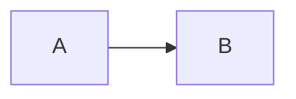

# Mermaid Previewer

一款用于预览和导出网页中mermaid图的chrome扩展，完全本地渲染mermaid，不涉及远程api调用。

在符合预设规则的网站中，markdown中设置代码块语言为mermaid即可实现预览或导出：

同时，还提供了自定义规则配置的功能。

## 预设规则

- 排除url
  - `https:\/\/.*chrome\.google\.com.*`
  - `chrome:\/\/.*`
  - `chrome-extension:\/\/.*`
- 匹配选择器
  - `.*bitbucket\.org.*` 下的 `div.codehilite > pre`
    - 支持Bitbucket的预览和导出
  - `file:\/\/.*.mmd` 下的 `body > pre`
    - 支持`.mmd`文件的预览和导出
- 下载选择器
  - `https:\/\/viewscreen\.githubusercontent\.com.*` 下的 `div.mermaid-view div.mermaid`
    - 支持GitHub的导出
  - `https:\/\/.*gitlab\.com.*` 下的 `div#app`
    - 支持Gitlab的导出

## 改动日志
- [1.4.1]  修复浮动按钮显示bug，增加复制code按钮。
- [1.4.0]  更新mermaid版本到10.2.0，使用plasmo框架重构代码，调整配置页面，导出功能使用浮动按钮提供。
- [1.3.0]  更新mermaid版本到10.1.0，导出功能改为导出svg，以支持更多样式和font-awesome。
- [1.2.9]  更新mermaid版本到10.0.2，支持font-awesome和gitGraph。
- [1.2.8]  更新mermaid版本到9.1.3，改进toast样式。
- [1.2.7]  更新mermaid版本到8.14.0，支持GitHub mermaid导出。
- [1.2.6]  更新mermaid版本到8.13.8，优化配置页交互与样式。
- [1.2.5]  更新mermaid版本到8.13.5，修复bitbucket预览问题。
- [1.2.4]  新增popup配置页，提供域名排除列表以及dom selector配置。
- [1.2.3]  更新mermaid版本到8.13.3。
- [1.2.2]  更新mermaid版本到8.13.2。
- [1.2.1]  修复Toast。
- [1.2.0]  新增mermaid图片导出。
- [1.1.0]  新增bitbucket支持，更新mermaid版本到8.12.1。
- [1.0.1]  更新mermaid版本到8.12.0。
- [1.0.0]  首次发布，mermaid版本8.11.5。

## TODO

- [x] 支持fontawesome。
- [x] 支持[mmd格式](https://github.com/mermaid-js/mermaid-cli)文件。
- [x] 增加浮动按钮，用于导出。
- [x] 增加浮动按钮，用于复制code。
- [ ] 增加测试用例。

## 鸣谢
感谢 [JetBrains](https://www.jetbrains.com/?from=ferry) 开源license授权

 

