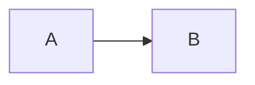

# Mermaid Previewer

## github has natively supported mermaid since 2022-02-14 [link](https://github.blog/2022-02-14-include-diagrams-markdown-files-mermaid/)

A chrome extension for previewing and exporting mermaid in github/bitbucket.

Set the code block language to mermaid in markdown:


Right-click on the rendered mermaid image and select "Export SVG" to export the SVG image.

## Support list

- [x] GitHub
  - [x] mermaid export
- [x] Bitbucket
  - [x] readme
  - [x] markdown preview
  - [x] edit preview
  - [x] ...
- [x] mermaid export.
- [x] Provide custom exclusion list and rule list configuration capabilities.

At the same time, the following pages with dom structure are supported:
```html
<pre lang="mermaid">
  <code>
    graph LR
    A --> B
  </code>
</pre>
```
or
```html
<div class="codehilite">
  <pre>
    graph LR
    A --> B
  </pre>
</div>
```


## Config

You can customize the configuration to support and exclude more websites. The default configuration of the extension is as follows:

Exclude Domain:
```
chrome.google.com
gitlab.com
```
Match Selectors:
```
pre[lang='mermaid'] > code
div.codehilite > pre
```

## Changelog
- [1.2.9]  Update mermaid version to 10.0.2, support font-awesome and gitGraph.
- [1.2.8]  Update mermaid version to 9.1.3, fix repeat toast & modify toast style.
- [1.2.7]  Update mermaid version to 8.14.0, support GitHub native mermaid download.
- [1.2.6]  Update mermaid version to 8.13.8, optimize configuration page interaction and style.
- [1.2.5]  Update mermaid version to 8.13.5, fix preview issue of Bitbucket.
- [1.2.4]  Added popup options page, providing domain exclusion and dom selector configuration.
- [1.2.3]  Update mermaid version to 8.13.3.
- [1.2.2]  Update mermaid version to 8.13.2.
- [1.2.1]  Fix Toast.
- [1.2.0]  Mermaid picture export.
- [1.1.0]  Added bitbucket support, updated mermaid version to 8.12.1.
- [1.0.1]  Update mermaid version to 8.12.0.
- [1.0.0]  First released, mermaid version 8.11.5.

## TODO

- [x] autotest suit.
- [x] download for GitHub native mermaid.
- [x] modify toast style.
- [x] support fontawesome.
- [ ] Consider supporting mmd format files.(https://github.com/mermaid-js/mermaid-cli)
- [ ] Fix github download toast duplication problem (separate rendering, contextmenu, toast script, only contextmenu script needs allFrames to execute)
- [ ] added hover menu for downloading/copying code.
- [ ] ...

## Vendor List

- https://github.com/mermaid-js/mermaid
- https://github.com/apvarun/toastify-js
- Thanks to [JetBrains](https://www.jetbrains.com/?from=ferry) open source license authorization
  <p>
   <a href="https://www.jetbrains.com/?from=ferry">
     
   </a>
  </p>
- https://github.com/tailwindlabs/tailwindcss
