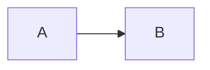

# Mermaid Previewer

A chrome extension for previewing and exporting mermaid images in web pages, fully rendering mermaid locally without involving remote api calls.

On websites that meet the preset rules, you can preview or export by setting the code block language in markdown to mermaid:

At the same time, it also provides the function of custom rule configuration.

## Preset Rules

- Exclude Urls
  - `https:\/\/.*chrome\.google\.com.*`
  - `chrome:\/\/.*`
  - `chrome-extension:\/\/.*`
- Matching Selectors
  - `div.codehilite > pre` under `.*bitbucket\.org.*`
    - Support Bitbucket preview and export
  - `body > pre` under `file:\/\/.*.mmd`
    - Support preview and export of `.mmd` files
- Download Selectors
  - `div.mermaid-view div.mermaid` under `https:\/\/viewscreen\.githubusercontent\.com.*`
    - Support GitHub export
  - `div#app` under `https:\/\/.*gitlab\.com.*`
    - Support Gitlab export

## Changelog
- [1.4.2]  Update mermaid version to 10.2.3, and adapt to quadrantChart, C4, mindmap, timeline charts.
- [1.4.1]  Fix floating button display bug, add copy code button.
- [1.4.0]  Update mermaid version to 10.2.0, use the plasmo framework to refactor the code, adjust the configuration page, and use the floating button to provide the export function.
- [1.3.0]  Update mermaid version to 10.1.0, the export function is changed to export svg to support more styles and font-awesome.
- [1.2.9]  Update mermaid version to 10.0.2, support font-awesome and gitGraph.
- [1.2.8]  Update mermaid version to 9.1.3, fix repeat toast & modify toast style.
- [1.2.7]  Update mermaid version to 8.14.0, support GitHub native mermaid download.
- [1.2.6]  Update mermaid version to 8.13.8, optimize configuration page interaction and style.
- [1.2.5]  Update mermaid version to 8.13.5, fix preview issue of Bitbucket.
- [1.2.4]  Added popup options page, providing domain exclusion and dom selector configuration.
- [1.2.3]  Update mermaid version to 8.13.3.
- [1.2.2]  Update mermaid version to 8.13.2.
- [1.2.1]  Fix Toast.
- [1.2.0]  Mermaid graph export.
- [1.1.0]  Added bitbucket support, updated mermaid version to 8.12.1.
- [1.0.1]  Update mermaid version to 8.12.0.
- [1.0.0]  First released, mermaid version 8.11.5.

## TODO

- [x] Support fontawesome.
- [x] Support [mmd format](https://github.com/mermaid-js/mermaid-cli) files.
- [x] Add floating button for export.
- [x] Add floating button for copying code.
- [x] Automation test.
- [ ] More test cases.
- [ ] Support comment for gist.

## Thanks
Thanks to [JetBrains](https://www.jetbrains.com/?from=ferry) open source license authorization

 

