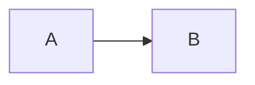

# Mermaid Previewer

A chrome plugin for previewing Mermaid. Mermaid version is **8.12.1**.

Temporarily only supports in markdown.

Please set the code language to mermaid, Like this:


## Support List

- [x] GitHub
  - [x] readme
  - [x] markdown preview
  - [x] edit preview
  - [x] gist(need name matching *.md)
  - [x] comment
  - [x] issue
  - [x] ...
- [x] Bitbucket
  - [x] readme
  - [x] markdown preview
  - [x] edit preview
  - [x] ...

If there are other pages that conform to the dom structure below, they can also be rendered.
```html
<pre lang="mermaid">
  <code>
    graph LR
    A --> B
  </code>
</pre>
```
or
```html
<div class="codehilite">
  <pre>
    graph LR
    A --> B
  </pre>
</div>
```


## Exclude List

The following websites natively support mermaid and will cause conflicts, so they are excluded from the plugin.

- gitlab.com

## TODO

- [ ] config page for exclude list and match list
- [X] export mermaid image file
- [ ] ...

## Vendor List
- CDN
  > https://cdn.jsdelivr.net/npm/mermaid/dist/mermaid.min.js
