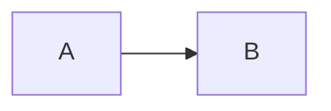

# Mermaid Previewer

A chrome plug-in for previewing the mermaid map in markdown, rendering the mermaid map locally, without involving remote api calls.
Currently supports GitHub and bitbucket, and adapts to mermaid 8.12.1 version.

Set the code block language to mermaid in markdown:


Right-click on the rendered mermaid image and select "Export png" to export the png image.

## Support list

- [x] GitHub
  - [x] readme
  - [x] markdown preview
  - [x] edit preview
  - [x] gist(need to match *.md)
  - [x] comment
  - [x] issue
  - [x] ...
- [x] Bitbucket
  - [x] readme
  - [x] markdown preview
  - [x] edit preview
  - [x] ...

At the same time, the following pages with dom structure are supported:
```html
<pre lang="mermaid">
  <code>
    graph LR
    A --> B
  </code>
</pre>
```
or
```html
<div class="codehilite">
  <pre>
    graph LR
    A --> B
  </pre>
</div>
```

## Exclude list

The following websites natively support mermaid or have dom structure conflicts, so they are excluded from this plugin.
- gitlab.com

## TODO

- [X] mermaid picture export.
- [ ] Provide custom exclusion list and rule list configuration capabilities.
- [ ] ...

## Vendor List

- https://github.com/mermaid-js/mermaid
- https://github.com/apvarun/toastify-js

## Changelog
- [1.2.1]  Fix Toast.
- [1.2.0]  Mermaid picture export.
- [1.1.0]  Added bitbucket support, updated mermaid version to 8.12.1.
- [1.0.1]  Update mermaid version to 8.12.0.
- [1.0.0]  First released, mermaid version 8.11.5.
