## flowchart
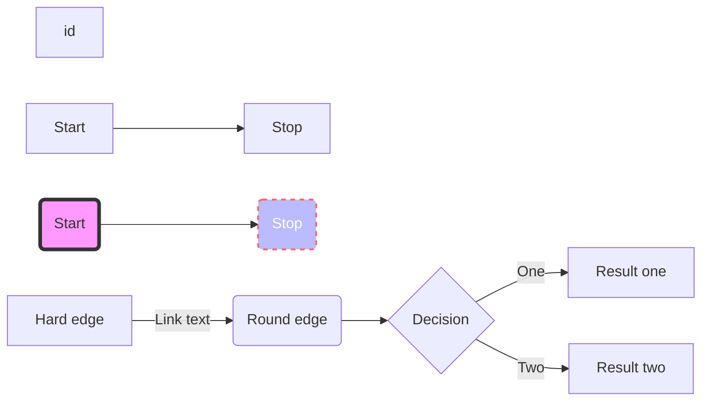
## graph ( same as flowchart )

## sequenceDiagram
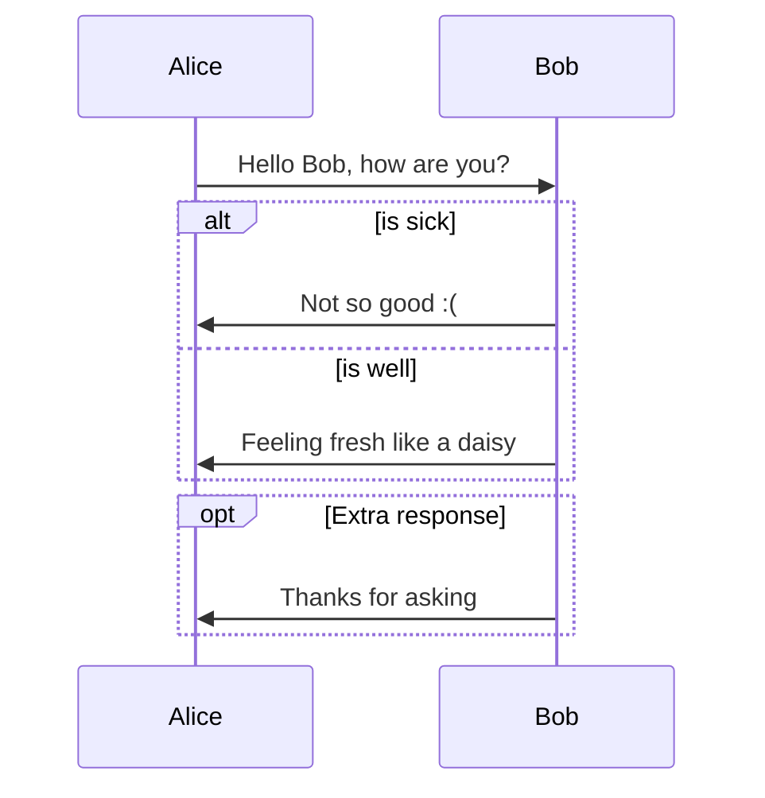
## classDiagram
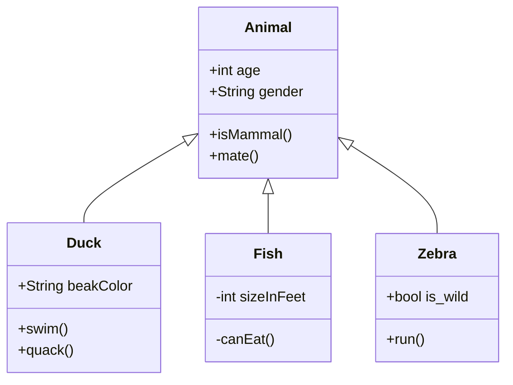
## stateDiagram-v2
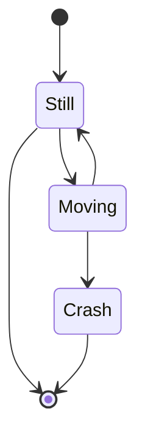
## stateDiagram-v1

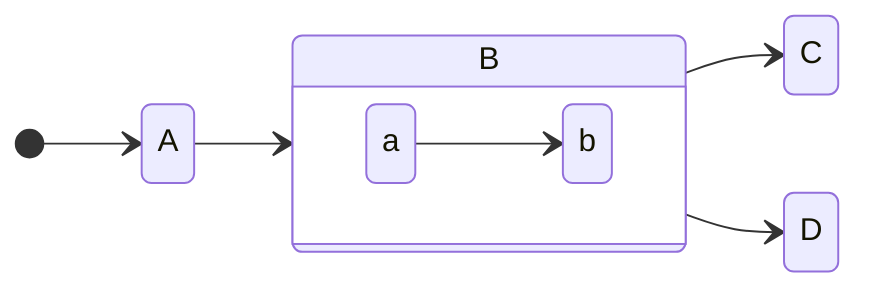

## erDiagram
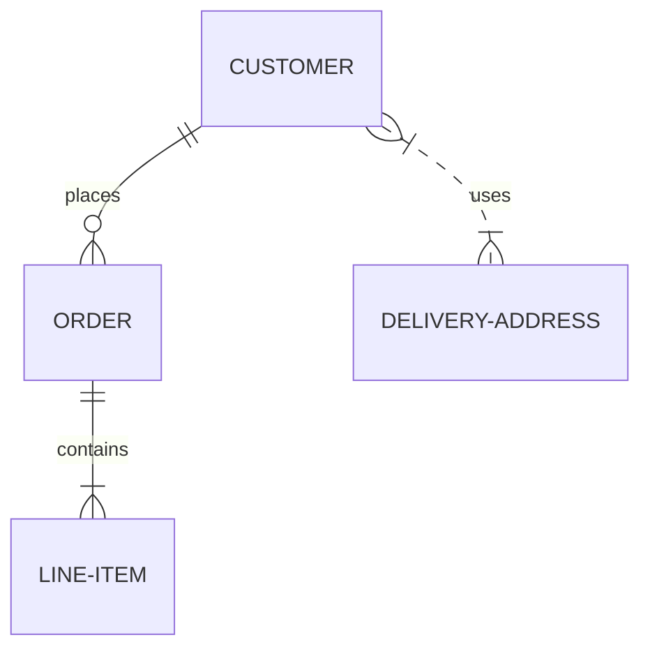

## journey
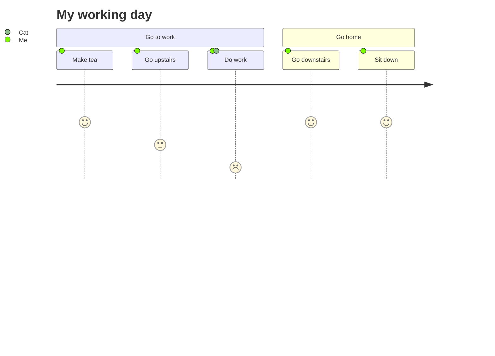

## gantt
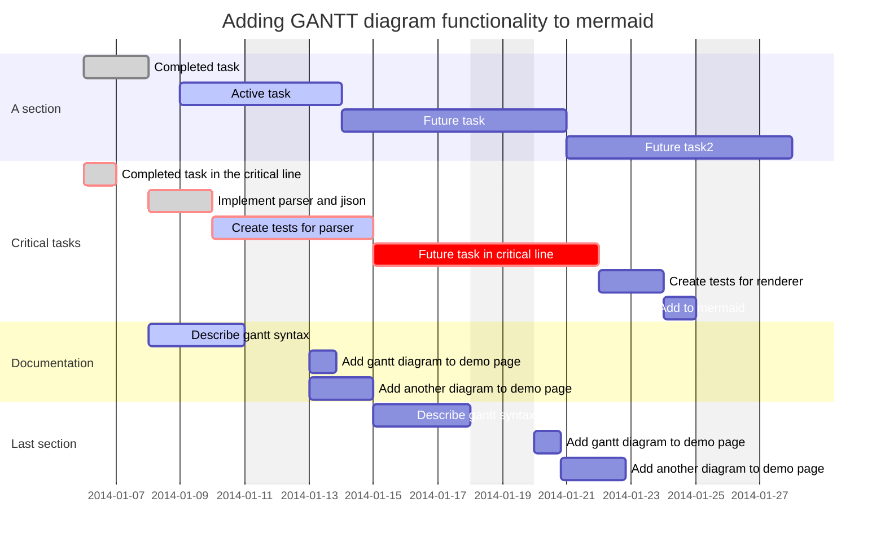

## pie
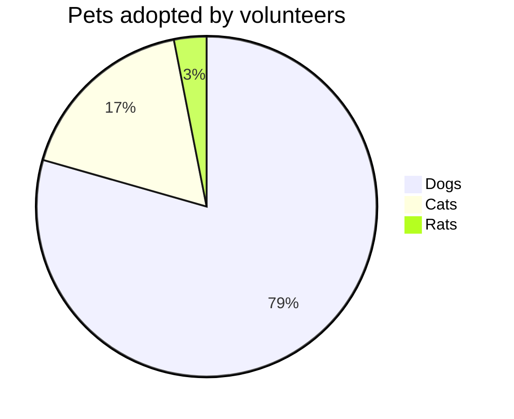

## requirementDiagram
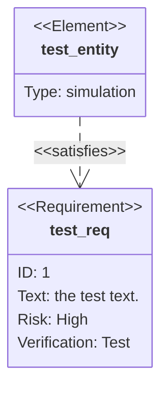

## gitGraph
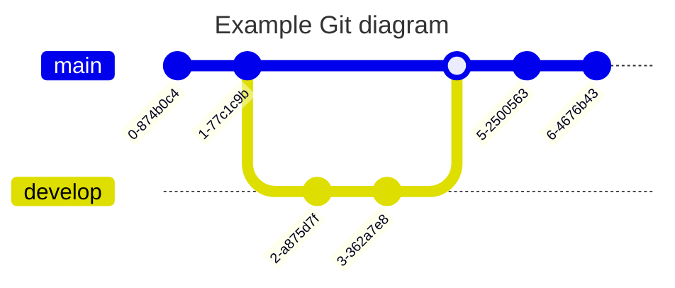
